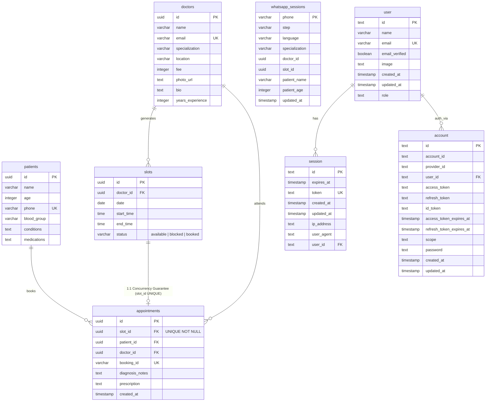

# CareLoop Data Model & Concurrency Guarantee

This document contains the Entity-Relationship (ER) diagram for CareLoop, illustrating the database structure and the concurrency guarantee enforced at the database level.

## Mermaid ER Diagram

## Concurrency Guarantee Explanation

As shown in the diagram:
- Each `slot` can have at most **one** corresponding `appointment` because of the `UNIQUE` constraint on `appointments.slot_id` at the database level.
- When two parallel booking requests for the same `slot_id` are fired, both will attempt to execute an `INSERT` into `appointments`.
- The database engine evaluates the `UNIQUE` constraint atomically. The transaction that is processed first will successfully insert the record.
- The second transaction will immediately fail with a Postgres error code `23505` (unique_violation).
- This ensures absolute data integrity and prevents double-booking under high concurrency without requiring application-level locking (mutexes, Redis locks) or slow `SELECT-then-INSERT` checks.
